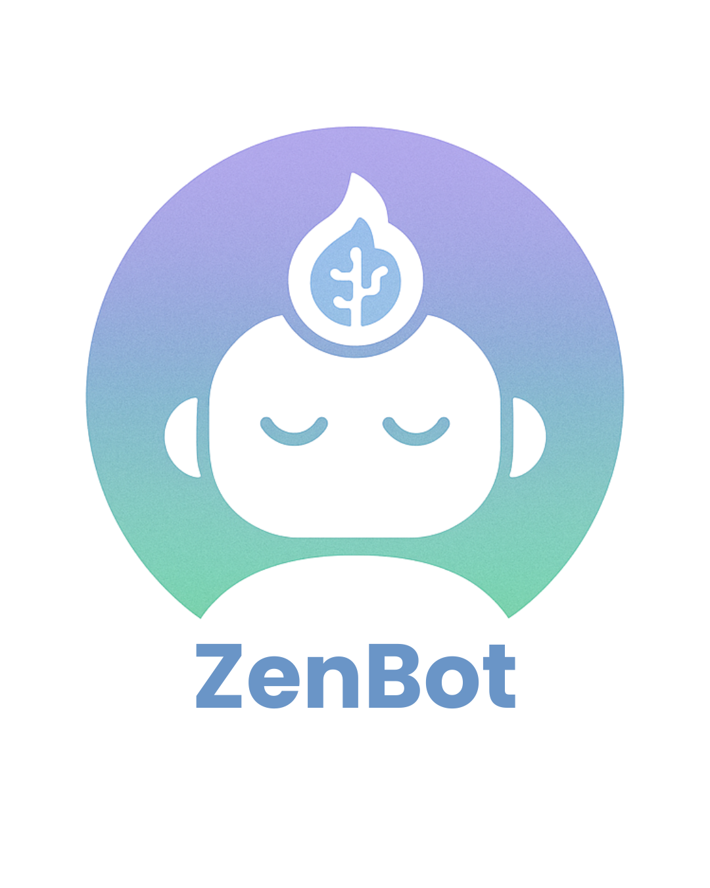

<!DOCTYPE html>
<html lang="pt-BR">
<head>
<meta charset="UTF-8" />
<meta name="viewport" content="width=device-width, initial-scale=1" />
</head>
<body>

<h1>ZenBot — Seu assistente virtual para foco e equilíbrio nos estudos</h1>

 
<h2>Estude com foco, cuide da mente e supere o estresse. ZenBot te ajuda a manter equilíbrio e motivação todos os dias!</h2>

  

<h2>🚀 Sobre</h2>

No ritmo acelerado dos estudos, manter foco e saúde emocional é essencial para o sucesso. ZenBot é seu assistente inteligente e empático que acompanha seu humor, organiza pausas e motiva você a estudar melhor, sem surtar. Estude com qualidade e cuide de você.

  
ZenBot é um chatbot inteligente e empático criado para ajudar estudantes a cuidar da saúde emocional, manter o foco e melhorar seus hábitos de estudo. Com check-ins diários, técnicas de respiração, modo Pomodoro personalizado e lembretes de autocuidado, o ZenBot te acompanha para que você estude melhor e viva com mais equilíbrio.

<h2>💡 Funcionalidades principais</h2>
<ul>
  <li><strong>Check-in emocional diário:</strong> Pergunta como você está se sentindo e adapta sugestões para o seu humor.</li>
  <li><strong>Modo foco no estudo - Pomodoro:</strong> Ciclos inteligentes de estudo com mensagens motivacionais e pausas ajustadas.</li>
  <li><strong>Lembretes de autocuidado:</strong> Incentivos para beber água, alongar, descansar e cuidar da mente.</li>
  <li><strong>Modo desabafo:</strong> Espaço para falar sobre seus sentimentos com respostas acolhedoras e motivacionais.</li>
  <li><strong>Respostas empáticas baseadas em IA:</strong> Utiliza GPT para oferecer apoio personalizado e incentivar o autocuidado.</li>
</ul>

<h2>🛠 Tecnologias usadas</h2>
<ul>
  <li>Python 3</li>
  <li>Google GenAI SDK</li>
  <li>Interface de linha de comando (CLI)</li>
  <li>(Opcional) Integração com Telegram Bot API ou plataformas web futuras</li>
</ul>

<h2>📋 Como usar</h2>
<ol>
  <li>Clone este repositório:
    <pre><code>git clone https://github.com/seu-usuario/ze-bot.git</code></pre>
  </li>
  <li>Instale as dependências:
    <pre><code>pip install -r requirements.txt</code></pre>
  </li>
  <li>Configure a variável de ambiente com sua API Key do Google GenAI:
    <pre><code>export GOOGLE_API_KEY="sua_chave_aqui"</code></pre>
  </li>
  <li>Execute o chatbot:
    <pre><code>python zebot.py</code></pre>
  </li>
</ol>

</body>
</html>
